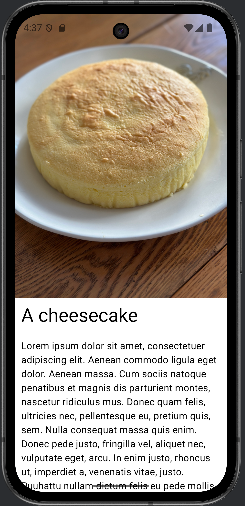
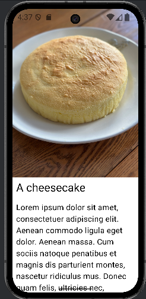
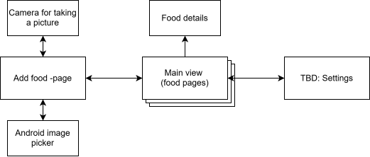

# Project description

[Link to repository](https://github.com/jonsetzky/mobile_computing_2026)

## Attached homeworks

Descriptions are found below and videos are in this directory.

- HW1
- HW2

## Implemented features

- Add new entries to database and display them (comments)
- Check and grant permission in runtime
- Camera functionality

## Course project overview

I developed a vague vision for a mobile app when discussing with my group during one of the first weekly design tasks for the project. For the project and other assignments, I have tried my best to implement features based on that vision.

Firstly, I added food comments to my database. Most difficult part was database migration because I didn't have the version schema exported. However, automigration worked as my modifications didn't rename or delete any existing columns and only added a new table. Joining the tables worked "magically" with `@Relation` annotation. Initially I was planning on using an array field on the `Food` entity but the separate table was way more ergonomic in the end.

Secondly, I made it possible to add food pictures using the camera. I implemented this partly in HW4 as this was a feature I thought would best fit the sensor assignment. Camera can be opened directly in the Add food -view, or by shaking the phone. Pictures are first saved into a temporary file and then into app-specific storage for persistent storage. While the permission for camera can be toggled in settings, it's also requested upon attempting to open camera if the permission hasn't been granted yet. Most difficult part of adding the camera functionality was finding all the "levers and switches" to make it work, such as adding the correct entries to `AndroidManifest.xml`.

Thirdly, I added settings view where permissions can be toggled on/off. Most of the implementation was copy-paste as all functionality (navigation, permission requesting) was already implemented somewhere else. My approach to disabling permissions used `context.revokeSelfPermissionOnKill()`, which doesn't immediately disable the permission but instead does it only upon stopping the application. This was a bit problematic in the sense that calling this method cannot be reverted and therefore I decided to disable the button if the user disables the permission. If the setting is disabled, a helper message will explain how to work around it.

## HW1's description

I added image using the builtin Image composable. Idea for the application came up from a discussion with friend where people can share what foods they have made and you can find inspiration for what to eat. I wanted to create a TikTok-like interface where an image of a food is displayed on the entire screen. For this assignment I implemented the fullscreen display where the food is displayed at the top of the screen and at the bottom there's its title and a text body with details.

The title and the text body are displayed with different fonts by using different font sizes (e.g. `Text(fontSize=8.em)`) and font styles (e.g. `Text(style=MaterialTheme.typography.titleLarge)`).

I made the content scrollable by adding `Modifier.verticalScroll` to a parent Composable which contained the pages components.

Registering user's clicks had a similiar approach where adding a `Modifier.clickable` made it possible to modify a state variable (`remember {mutableStateOf()}`). Using the state variable makes it possible to rerender the page.

### HW1 extra requirements

Changing the font size affects only font sizes of food detail pages and Add Food -page's input boxes. Header's text sizes aren't affected.

Food details with a small font size:

Food details with a big font size:

## HW2's description

The application is split in to three distinct views: the main view or the feed, post creation view and a settings view (that's not implemented at the point of writing this).

My initial "navigation" for this exercise didn't utilize actual navigation but instead used a single view that barely would have passed the requirements for this exercise. But after HW3 I implemented a screen for creating database entries for which I did implement navigation with a `rememberNavController()` and a `NavHost() {}`.

The initial navigation didn't have any visible button, but instead the view toggled by clicking the food's image.

The main view uses `BackHandler` to implement back gesture within view. Navigation's back gesture appears to work out-of-box for me so there was no need to prevent circular navigation.

Later for the final navigation I used `data class AddFood` as a destination object for the Add food -view with a single boolean property `openCamera` which opens the camera if set to true. Food view uses an empty `object FoodView` as its destination. The "in-view" navigation for the food view is managed with `MutableStateFlow`s in `FoodViewModel._currentFood`.

### HW2 extra requirements

The user is expected to spend most of their time in the main view and that's the view which opens on startup. All other views can be navigated to with a single click.

A chart of the views. At the point of writing I hadn't yet implemented the settings screen.

